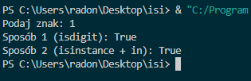

## task-01

**Treść zadania:**
Program sprawdza, czy wczytany pojedynczy znak jest cyfrą. Jeśli wczytamy więcej znaków, bierze tylko pierwszy.

**Plik z rozwiązaniem:** [task-01.py](./task-01.py)

**Zrzut ekranu:**
