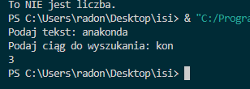
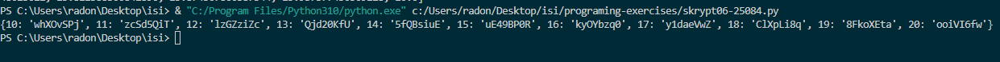
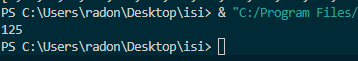

## task-01

**Treść zadania:**
Program sprawdza, czy wczytany pojedynczy znak jest cyfrą. Jeśli wczytamy więcej znaków, bierze tylko pierwszy.

**Plik z rozwiązaniem:** [task-1.py](./task-1.py)

**Zrzut ekranu:**

## task-02

**Treść zadania:**
Napisz program, który sprawdza czy wczytany łańcuch znakowy jest liczbą lub nie. Muszą być wczytane co najmniej dwa znaki.
Hint: skorzystaj z funkcji all().

**Plik z rozwiązaniem:** [task-02.py](./task-02.py)

**Zrzut ekranu:**

## task-03

**Treść zadania:**
Napisz program, który szuka określonego ciągu znaków w łańcuchu znakowym i zwraca indeks pierwszego wystąpienia ciągu lub -1, gdy nie ma takiego ciągu.
Hint: skorzystaj z funkcji find().

**Plik z rozwiązaniem:** [task-03.py](./task-03.py)

**Zrzut ekranu:**

## task-04

**Treść zadania:**
Napisz program, który szuka określonego ciągu znaków w łańcuchu znakowym i zwraca indeksy wszystkich wystąpień ciągu lub -1, gdy nie ma takiego ciągu.
Hint: skorzystaj z funkcji split().

**Plik z rozwiązaniem:** [task-04.py](./task-04.py)

**Zrzut ekranu:**

## task-05

**Treść zadania:**
Napisz program (na dwa sposoby), który szuka pierwiastków liczb od 1 do 256 (włącznie) podzielnych bez reszty przez 2.
Hint: skorzystaj z modułu math i z tzw. 'list comprehensions'.

**Plik z rozwiązaniem:** [task-05.py](./task-05.py)

**Zrzut ekranu:**

## task-06

**Treść zadania:**
Napisz program, który tworzy słownik o nazwie zawierającej Twój numer albumu.
Kluczami powinny być liczby od 10 do 20, a wartościami pseudolosowe łańcuch znaków o długości 8.
Hint: skorzystaj z modułów string i random.

**Plik z rozwiązaniem:** [task-06.py](./task-06.py)

**Zrzut ekranu:**

## task-07

## Opis

- Plik `utils/obliczenia.py` zawiera cztery funkcje matematyczne
  - `pierwiastek(x)` 
  - `potega(x, y)`
  - `logarytm(x, podstawa=math.e)`
  - `silnia(x)` 

**Treść zadania:**
Stwórz folder utils, a w nim plik 'obliczenia.py', w którym należy zaimplementować cztery wybrane funkcje matematyczne z modułu math.
Następnie należy utworzyć plik skrypt7-nr_albumu.py i zaimportować w nim ww. funkcje do obliczeń na przykładowych wartościach.

**Plik z rozwiązaniem:** [skrypt7_25084.py](./skrypt7_25084.py) [obliczenia.py](./utils/obliczenia.py)

**Zrzut ekranu:**

## task-08

**Treść zadania:**
Napisz program, który generuje losowy ciąg znaków o długości 100, a następnie utwórz słownik którego kluczami będą unikalne znaki występujące w ciągu, a wartościami liczba ich wystąpień w ciągu znakowym. Utwórz listę, której każdy element to krotka (tupla), zawierająca kolejny klucz z ww. słownika i odpowiadającą mu wartość liczbową.
Hint: skorzystaj z modułu collections i klasy Counter().

**Plik z rozwiązaniem:** [task-08.py](./task-08.py)

**Zrzut ekranu:**

## task-09

**Treść zadania:**
Stwórz klasy Vehicle i Car z polami nazwa, rok_produkcji i przebieg oraz metodami is_old() i is_long_mileage(). Stwórz po jednym obiekcie dla każdej z klas oraz trzeci obiekt, gdzie klasa Car dziedziczy z klasy Vehicle. Dla każdego z obiektów wywołaj obie metody, co najmniej raz użyj dekoratora @property w każdym z trzech przypadków.

**Plik z rozwiązaniem:** [task-09.py](./task-09.py)

**Zrzut ekranu:**

## task-10

**Treść zadania:**
Napisz program, który korzystająć z metody chr() wygeneruje łańcuch znakowy z alfabetem, czyli 'abc....xyz'. Do pliku alfabet1-numeralbumu.txt zapisz wygenerowany łańcuch znakowy, a do pliku alfabet2-numeralbumu.txt zapisz litery z ww. łańcucha znakowego, tylko że każda litera ma się znaleźć w osobnej linii w pliku.
Hint: oprócz funkcji write() skorzystaj również z menadżera kontekstu with, żeby nie zapomnieć o zamknięciu pliku.
**Plik z rozwiązaniem:** [task-10.py](./task-10.py)

**Zrzut ekranu:**

## task-11

**Treść zadania:**
Odwrócić sentencję podaną przez użytkownika.

**Plik z rozwiązaniem:** [task-11.py](./task-11.py)

**Zrzut ekranu:**

## task-12

**Treść zadania:**
Zamienić wszystkie litery o na 0, e na 3, i na 1, a na 4 w podanej przez użytkownika sentencji.

**Plik z rozwiązaniem:** [task-12.py](./task-12.py)

**Zrzut ekranu:**

## task-13

**Treść zadania:**
Używając pętli wyświetl liczby w przedziale od 1 do 50 oprócz liczb podzielnych przez 3.
**Plik z rozwiązaniem:** [task-13.py](./task-13.py)

**Zrzut ekranu:**

## task-14

**Treść zadania:**  
Używając pętli dodaj do wcześniej zadeklarowanej tabeli liczby z przedziału 1-100, które są podzielne przez 3 i 4.

**Plik z rozwiązaniem:** [task-14.py](./task-14.py)

**Zrzut ekranu:**

## task-15

**Treść zadania:**  
Używając pętli dodaj do wcześniej zadeklarowanej tabeli liczby z przedziału 1-100, które są podzielne przez 3 lub 5.

**Plik z rozwiązaniem:** [task-15.py](./task-15.py)

**Zrzut ekranu:**

## task-16

**Treść zadania:**  
Napisz funkcję `potega()`, która podnosi podaną liczbę do trzeciej potęgi.

**Plik z rozwiązaniem:** [task-16.py](./task-16.py)

**Zrzut ekranu:**
