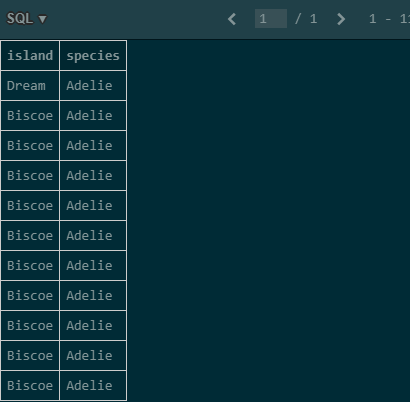
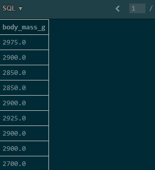
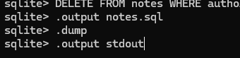

# SQL Exercises - Core Features

## exercise-01
**Treść zadania:**  
Write a SQL query to select the sex and body mass columns from the little_penguins in that order, sorted such that the largest body mass appears first.

**Zapytanie SQL:**
```sql
SELECT
    sex,
    body_mass_g
FROM
    little_penguins
ORDER BY
    body_mass_g DESC;
```

**Zrzut ekranu:**


## exercise-02
**Treść zadania:**  
Write a SQL query to select the islands and species from rows 50 to 60 inclusive of the penguins table. Your result should have 11 rows.

Napisz zapytanie SQL, które wybiera kolumny island oraz species z wierszy od 50 do 60 włącznie z tabeli penguins. Wynik powinien zawierać 11 wierszy.
**Zapytanie SQL:**
```sql

SELECT island, species
FROM (
    SELECT island, species
    FROM penguins
    LIMIT 11 OFFSET 49 
);
```

**Zrzut ekranu:**


## exercise-03
**Treść zadania:**  
Modify your query to select distinct combinations of island and species from the same rows and compare the result to what you got in part 1.

Zmień zapytanie, aby wybierało unikatowe kombinacje island i species z tych samych wierszy i porównaj wynik z częścią pierwszą.
**Zapytanie SQL:**
```sql

SELECT DISTINCT island, species
FROM (
    SELECT island, species
    FROM penguins
    LIMIT 11 OFFSET 49
);
```

**Zrzut ekranu:**


## exercise-04
**Treść zadania:**  
Write a query to select the body masses from penguins that are less than 3000.0 grams.

Napisz zapytanie SQL, które wybiera masy ciała (body_mass_g) pingwinów ważących mniej niż 3000.0 gramów.
**Zapytanie SQL:**
```sql

SELECT DISTINCT island, species
FROM (
    SELECT island, species
    FROM penguins
    LIMIT 11 OFFSET 49
);
```

**Zrzut ekranu:**


## exercise-05
**Treść zadania:**  
Write another query to select the species and sex of penguins that weight less than 3000.0 grams. This shows that the columns displayed and those used in filtering are independent of each other.

Napisz kolejne zapytanie, które wybiera gatunek (species) i płeć (sex) pingwinów ważących mniej niż 3000.0 gramów.
**Zapytanie SQL:**
```sql

SELECT species, sex
FROM penguins
WHERE body_mass_g < 3000.0;
```

**Zrzut ekranu:**


## exercise-06
**Treść zadania:**  
Use the not operator to select penguins that are not Gentoos.

Użyj operatora not, aby wybrać pingwiny inne niż Gentoo.
**Zapytanie SQL:**
```sql

SELECT * 
FROM penguins 
WHERE species != "Gentoo";
```

**Zrzut ekranu:**


## exercise-07
**Treść zadania:**  
SQL's or is an inclusive or: it succeeds if either or both conditions are true. SQL does not provide a specific operator for exclusive or, which is true if either but not both conditions are true, but the same effect can be achieved using and, or, and not. Write a query to select penguins that are female or on Torgersen Island but not both.

W SQL operator OR oznacza alternatywę łączną: zwraca wynik, jeśli jedno lub oba warunki są spełnione.
SQL nie ma operatora dla alternatywy rozłącznej (XOR), która jest prawdziwa, gdy tylko jeden z warunków jest spełniony (ale nie oba).
Można to jednak osiągnąć, używając AND, OR i NOT.
Napisz zapytanie, które wybierze pingwiny, które są samicami LUB znajdują się na wyspie Torgersen, ale NIE spełniają obu tych warunków jednocześnie.
**Zapytanie SQL:**
```sql

SELECT * 
FROM penguins 
WHERE (island="Torgersen" 
AND sex !="FEMALE") 
OR (island!="Torgersen" 
AND sex="FEMALE");
```

**Zrzut ekranu:**


## exercise-08
**Treść zadania:**  
Write a single query that calculates and returns:
A column called what_where that has the species and island of each penguin separated by a single space.
A column called bill_ratio that has the ratio of bill length to bill depth.

Napisz jedno zapytanie SQL, które oblicza i zwraca:
Kolumnę o nazwie what_where, która zawiera gatunek i wyspę każdego pingwina, oddzielone pojedynczą spacją.
Kolumnę o nazwie bill_ratio, która zawiera stosunek długości dzioba do jego głębokości.
**Zapytanie SQL:**
```sql

SELECT 
  species || ' ' || island AS what_where,
  bill_length_mm / bill_depth_mm AS bill_ratio
FROM penguins;
```

**Zrzut ekranu:**


## exercise-09
**Treść zadania:**  
Use SQLite's .nullvalue command to change the printed representation of null to the string null and then re-run the previous query. When will displaying null as null be easier to understand? When might it be misleading?


**Zapytanie SQL:**
```sql

.nullvalue null
SELECT species || ' ' || 
island ,bill_length_mm / bill_depth_mm as bill_ratio 
FROM penguins;
```

**Zrzut ekranu:**


## exercise-10
**Treść zadania:**  
Write a query to find penguins whose body mass is known but whose sex is not.

Napisz zapytanie SQL, które wybiera pingwiny, których masa ciała jest znana, ale płeć jest nieznana (czyli sex IS NULL):

**Zapytanie SQL:**
```sql

SELECT *
FROM penguins
WHERE body_mass_g IS NOT NULL
  AND sex IS NULL;
```

**Zrzut ekranu:**


## exercise-11
**Treść zadania:**  
Write another query to find penguins whose sex is known but whose body mass is not.

Napisz kolejne zapytanie, aby znaleźć pingwiny, których płeć jest znana, ale masa ciała nie jest znana.

**Zapytanie SQL:**
```sql

SELECT *
FROM penguins
WHERE body_mass_g IS NULL
  AND sex IS NOT NULL;
```

**Zrzut ekranu:**


## exercise-12
**Treść zadania:**  
What is the average body mass of penguins that weight more than 3000.0 grams?

Jaka jest średnia masa ciała pingwinów ważących ponad 3000,0 gramów?
**Zapytanie SQL:**
```sql

SELECT AVG(body_mass_g) 
as average_body_mass
FROM 
(SELECT body_mass_g FROM penguins 
WHERE body_mass_g > 3000);
```

**Zrzut ekranu:**


## exercise-13
**Treść zadania:**  
How many different body masses are in the penguins dataset?

Ile różnych mas ciała znajduje się w zbiorze danych dotyczącym pingwinów?
**Zapytanie SQL:**
```sql

SELECT COUNT(DISTINCT body_mass_g) AS unique_body_masses
FROM penguins;
```

**Zrzut ekranu:**


## exercise-14
**Treść zadania:**  
Write a query that shows each distinct body mass in the penguin dataset and the number of penguins that weigh that much.

Napisz zapytanie, które wyświetli każdą odrębną masę ciała w zbiorze danych dotyczących pingwinów i liczbę pingwinów, które ważą tyle samo
**Zapytanie SQL:**
```sql

SELECT body_mass_g, COUNT(*) AS count
FROM penguins
WHERE body_mass_g IS NOT NULL
GROUP BY body_mass_g
ORDER BY body_mass_g;
```

**Zrzut ekranu:**


## exercise-15
**Treść zadania:**  
Write a query that uses filter to calculate the average body masses of heavy penguins (those over 4500 grams) and light penguins (those under 3500 grams) simultaneously. Is it possible to do this using where instead of filter?

Napisz zapytanie, które używa filtra do obliczenia średniej masy ciała ciężkich pingwinów (tych powyżej 4500 gramów) i lekkich pingwinów (tych poniżej 3500 gramów) jednocześnie. Czy można to zrobić używając where zamiast filtra?
**Zapytanie SQL:**
```sql

SELECT 
  AVG(CASE WHEN body_mass_g > 4500 THEN body_mass_g ELSE NULL END) AS avg_heavy,
  AVG(CASE WHEN body_mass_g < 3500 THEN body_mass_g ELSE NULL END) AS avg_light
FROM penguins;
```

**Zrzut ekranu:**


## exercise-16
**Treść zadania:**  
Using an in-memory database, define a table called notes with two text columns author and note and then add three or four rows. Use a query to check that the notes have been stored and that you can (for example) select by author name.

Używając bazy danych w pamięci, zdefiniuj tabelę o nazwie notatki z dwiema kolumnami tekstowymi autor i notatka, a następnie dodaj trzy lub cztery wiersze. Użyj zapytania, aby sprawdzić, czy notatki zostały zapisane i czy możesz (na przykład) wybrać według nazwiska autora.
**Zapytanie SQL:**
```sql


CREATE TABLE notes (
  author TEXT,
  note TEXT
);

INSERT INTO notes (author, note)
VALUES 
  ('Ala', 'Kup mleko'),
  ('Ola', 'Notatka'),
  ('Jan', '<3');

SELECT * FROM notes;

```

**Zrzut ekranu:**


## exercise-17
**Treść zadania:**  
What happens if you try to delete rows that don't exist (e.g., all entries in work that refer to juna)?

Co się stanie, jeśli spróbujesz usunąć wiersze, które nie istnieją (np. wszystkie wpisy w pracy odnoszące się do juna)?


**Zapytanie SQL:**
```sql

DELETE FROM work WHERE author = 'Jan';

```

**Zrzut ekranu:**


## exercise-18
**Treść zadania:**  
Re-create the notes table in an in-memory database and then use SQLite's .output and .dump commands to save the database to a file called notes.sql. Inspect the contents of this file: how has your data been stored?


Utwórz ponownie tabelę notatek w bazie danych w pamięci, a następnie użyj poleceń .output i .dump SQLite, aby zapisać bazę danych w pliku o nazwie notes.sql. Sprawdź zawartość tego pliku: w jaki sposób Twoje dane zostały zapisane?
**Zapytanie SQL:**
```sql

sqlite> .output notes.sql
sqlite> .dump
sqlite> .output stdout

```

**Zrzut ekranu:**

